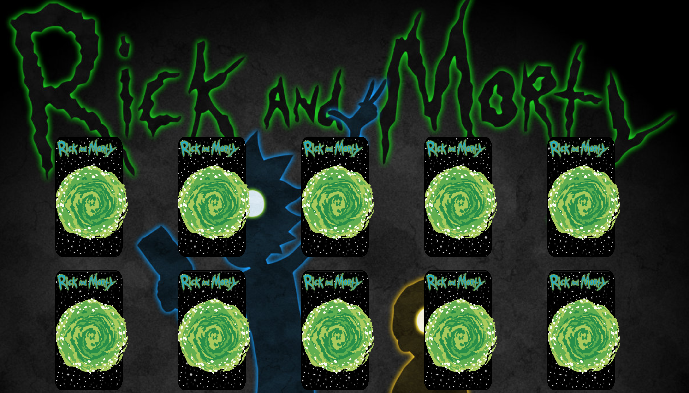

# ♠️ Week08 Bootcamp2019a Project: Matching Card Game

### Goal: Make a 10 card memory game - users must be able to select two cards and check if they are a match. If they are a match, they stay flipped. If not, they flip back over. Game is done when all cards are matched and flipped over. Example: http://www.fruit-burst.co.uk/fun-and-games/pairs-game



### lessons learned:
```
Although this was no "walk in the park", it was really satisfying to see it start working and so well. I learned how to randomly switch up the classes assigned to each element in each of the games by creating an algorithm that randomizes the given values position in an array. Then assigning those values to specific elements. I also utilized a background image a section with an image and a floated image to create the illusion of the Rick and Morty characters popping out of the portals.  

```
